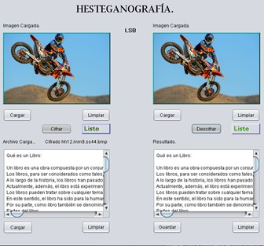

# Esteganografia Digital con Imagenes
## Técnica de cifrado en java

Lenguaje: Java
IDE: Netbins

En el presente proyecto, se realizo un programa que utiliza como contenedor una imagen para resguardar texto. Utilizando el Método LSB (Least Significant Bit).

## LSB (Least Significant Bit).

  

  Tecnica mediante la cual, se manipulan los bits menos significativos, orientado al procesamiento de imagenes se toma en cuenta cada pixel de la imagen y se modifica su bit menos significativo de tal forma que estos sean remplazados por la cadena binaria del contenido a ingresar
